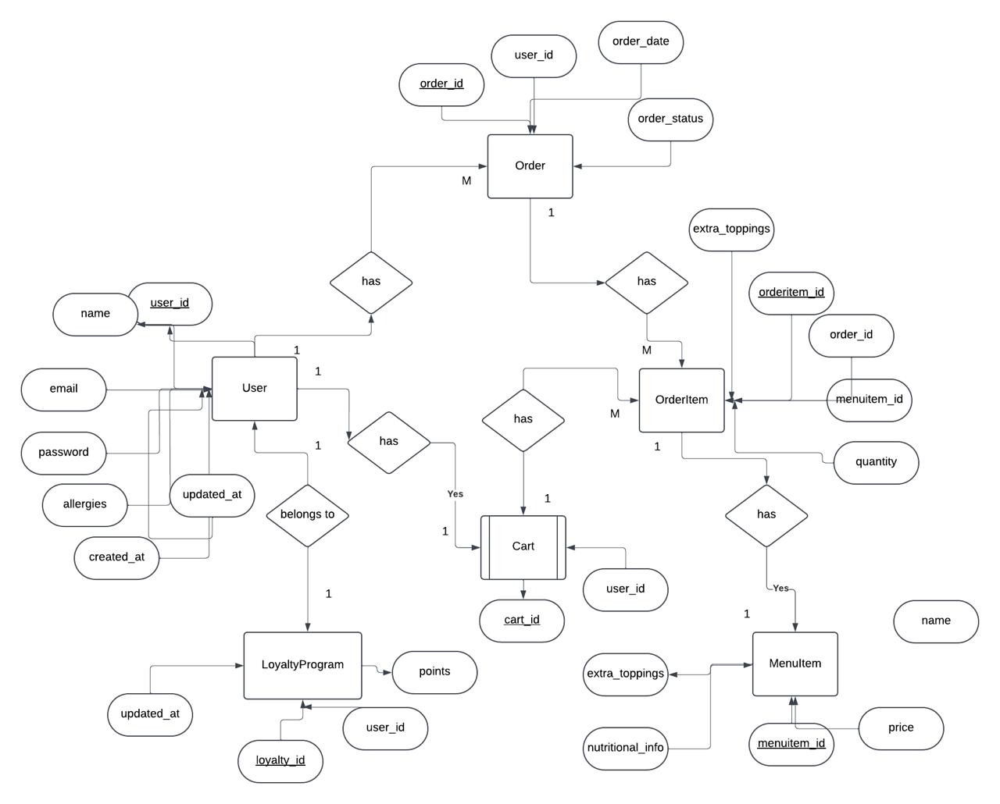
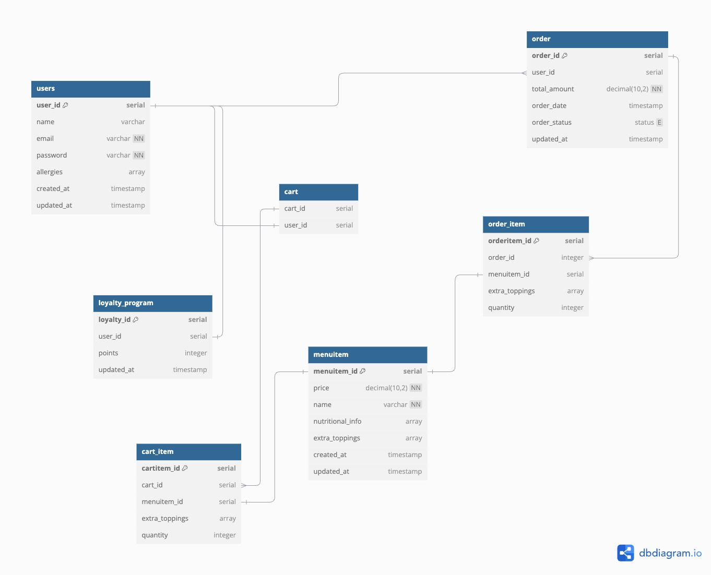
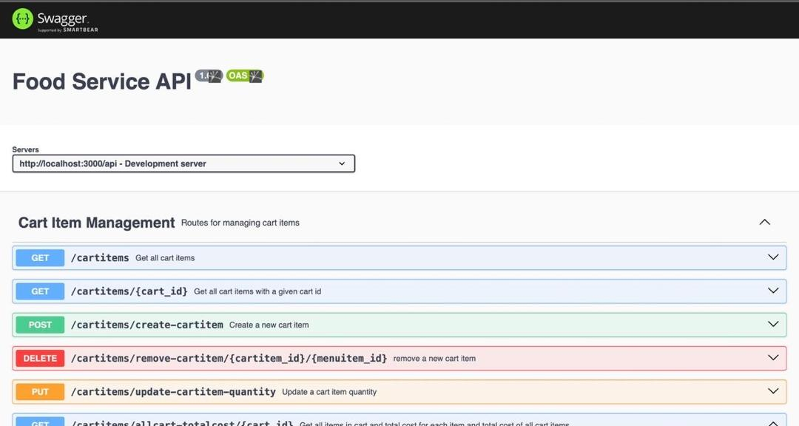
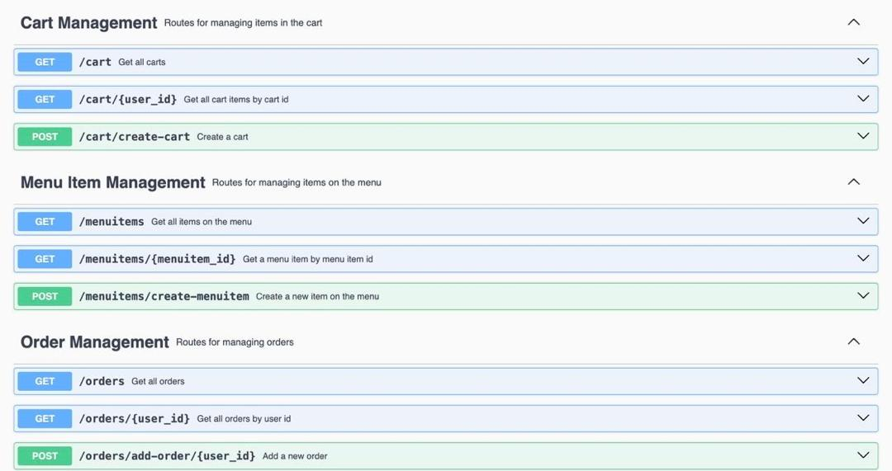
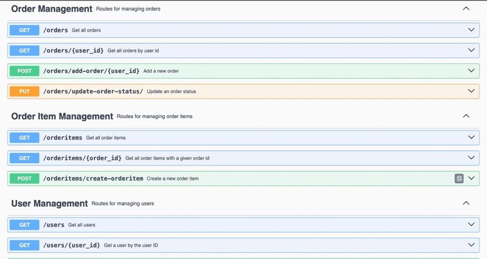

# Canteen Ordering System

## Project Overview

The Canteen Ordering System is a responsive platform designed for students and staff to:
- Browse the canteen menu
- Place orders
- Track orders in real time

The platform ensures user-friendly interaction by providing:
- Secure registration
- Menu customization
- A loyalty program to enhance the user experience

# Entity-Relationship Diagram

This shows all the entities, attributes and cardinality.

# Full Database Schema

This is the full database schema which specifies the datatypes used in the project and the primary keys, foreign keys, and so on. This was written with the Data Modelling Language.

## Deployment Link

Access the deployed application here: [Canteen Ordering System](https://food-service-fronted.vercel.app/)
 
Access the Application Programming Interface Documentation: [API Documentation](https://food-service-d1ed0096c526.herokuapp.com/api-docs/)

## Login Details

 Authentication is required, use the following test credentials to access the system:

- **Username:** testuser@example.com
- **Password:** password123

## Installation Instructions
Clone the repository:  
Backend: [Server App](https://github.com/HENDRIXTHEALLFATHER/foodservice_backend.git)  
Frontend: [Client App](https://github.com/HENDRIXTHEALLFATHER/food_service_frontend.git)

## Install dependencies:
npm install

## Start the development server application:
npm start

## Comprehensive API Documentation using Swagger

The API documentation provides detailed information about the endpoints, request parameters, and responses. It is generated using Swagger, which allows for easy exploration and testing of the API.

### Overview

This image shows the overview of the API documentation, including the available endpoints and their descriptions.

### Endpoint Details

This image provides detailed information about a specific endpoint, including the request method, URL, parameters, and example responses.

### Response Examples

This image shows example responses for the API endpoints, helping developers understand the expected output for different requests.

### How to Use Swagger
1. **Access the Swagger UI**: Navigate to the `/api-docs` endpoint of your deployed application to access the Swagger UI.
2. **Explore Endpoints**: Browse through the list of available endpoints. Each endpoint is documented with its request method, URL, parameters, and responses.
3. **Try Out Endpoints**: Use the "Try it out" feature to test the endpoints directly from the Swagger UI. Enter the required parameters and execute the request to see the response.
4. **View Responses**: Check the response section to see the status code, response body, and headers for each request.

### Benefits of Using Swagger
- **Interactive Documentation**: Swagger provides an interactive interface for exploring and testing API endpoints.
- **Standardized Format**: The documentation follows the OpenAPI Specification, ensuring consistency and compatibility.
- **Ease of Use**: Developers can easily understand and use the API without needing to refer to external documentation.

For more information on how to use Swagger, visit the [Swagger Documentation](https://swagger.io/docs/).

